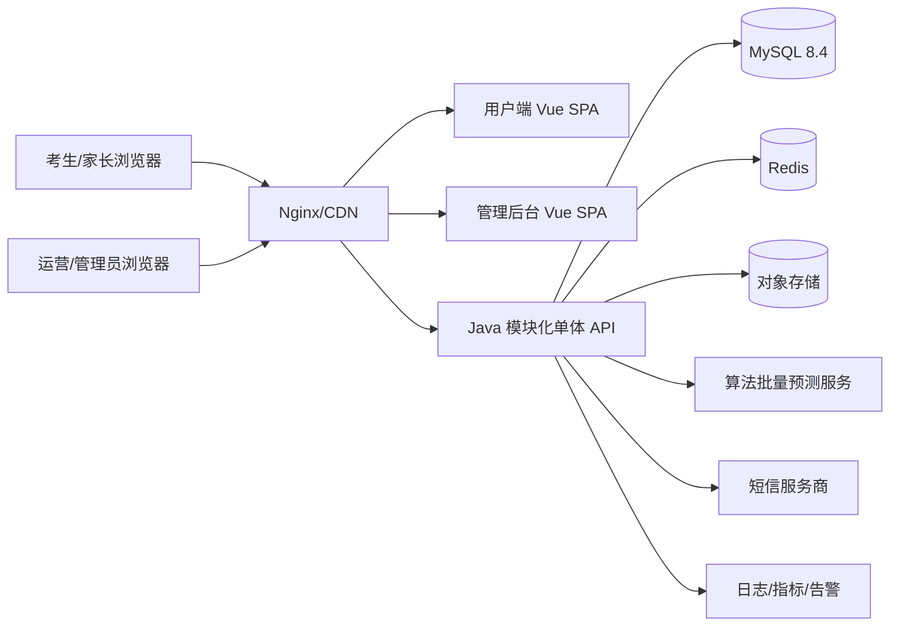
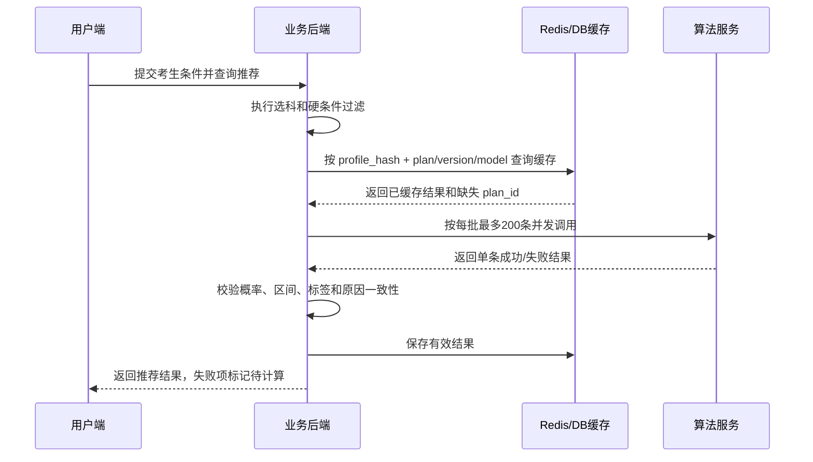
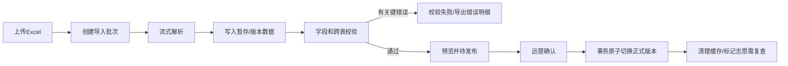

# 山东高考志愿辅助平台 MVP 技术方案 V1.0

> 适用范围：山东省高考志愿辅助平台第一版 MVP  
> 依据文档：《山东高考志愿辅助平台功能方案》《山东高考志愿辅助平台 MVP PRD V1.0》  
> 目标：实现“考生信息 → 位次匹配 → 选科过滤 → 专业计划推荐 → 概率评估 → 志愿编排 → 风险检查 → Excel 导出”的完整闭环。

---

## 1. 方案结论

MVP 推荐采用 **前后端分离 + Java 模块化单体 + 独立算法服务 + MySQL/Redis** 的架构。

不建议第一版拆分微服务。当前业务的主要复杂度在数据版本、选科规则、推荐查询、算法批量调用和志愿表一致性，模块化单体更容易保证事务、发布原子性和研发效率；算法服务保持独立，通过批量接口接入，后续业务量明确后再拆分推荐、数据和导出服务。

关键技术决策：

1. **招生计划 `plan_id` 是推荐、概率、收藏/加入志愿表和检查的最小业务单位**。
2. **历史数据通过稳定的 `plan_series_id` 关联**，不得只按学校名或专业名匹配。
3. **招生数据采用版本化、先校验后发布、原子切换正式版本**，失败不影响上一版本。
4. **选科要求同时保存原文、结构化规则和可查询位图**，只有校验通过的数据才能发布。
5. **算法统一由后端批量调用并缓存**，前端不计算概率和冲稳保；算法异常时基础查询仍可用。
6. **志愿表采用乐观锁版本号和事务保存**，防止旧请求覆盖新操作。
7. **用户端和管理后台分开构建，后端共用一套业务服务和权限体系**。

### 1.1 MVP 不做

- 不做自动生成完整 96 个志愿；
- 不做 AI 对话顾问；
- 不做就业、薪资、考研率等扩展数据；
- 不做社区、协作、支付、小程序和 App；
- 不做复杂院校优先/专业优先综合评分；
- 不做院校网站自动爬取；
- 不引入 Kafka、分布式事务、服务网格等非必要基础设施。

---

## 2. 技术选型

### 2.1 后端

| 类别 | 选型 | 说明 |
|---|---|---|
| 语言 | Java 21 LTS | 成熟稳定，适合长期维护；如团队已统一 Java 25 LTS，可评估后升级 |
| 框架 | Spring Boot 3.5.x 稳定线 | MVP 优先选择生态成熟、兼容性好的 3.x；不建议首版直接采用刚升级的大版本 |
| Web | Spring MVC | 业务以数据库查询、文件处理和外部 HTTP 调用为主，无需引入响应式复杂度 |
| 安全 | Spring Security + Redis Session | 用户手机号验证码登录；使用 HttpOnly Cookie，不在 localStorage 保存长期令牌 |
| 数据访问 | MyBatis-Plus + MyBatis XML/自定义 SQL | 基础 CRUD 简化，推荐列表和分组查询使用可控 SQL |
| 数据库迁移 | Flyway | 所有表结构和基础字典版本化 |
| 接口文档 | springdoc-openapi | 自动生成 OpenAPI，前后端以契约联调 |
| 参数校验 | Jakarta Validation | DTO 字段校验与统一错误返回 |
| HTTP 客户端 | Spring RestClient/HTTP Interface | 调用算法服务，配置连接池、超时、重试和熔断 |
| 韧性 | Resilience4j | 算法接口限时、重试、熔断、隔离 |
| Excel | Apache POI（SAX/SXSSF） | 导入使用流式解析，导出 96 条数据可直接生成 |
| 测试 | JUnit 5、Mockito、Testcontainers、WireMock | 单元、数据库集成、算法契约及异常测试 |

### 2.2 前端

| 类别 | 选型 | 说明 |
|---|---|---|
| 框架 | Vue 3 + TypeScript | 适合中后台及数据密集型页面 |
| 构建 | Vite | 开发和构建链路简单 |
| UI | Element Plus | 表单、表格、抽屉、弹窗和后台组件完备 |
| 路由 | Vue Router | 用户端和后台分别维护路由 |
| 状态 | Pinia | 管理登录态、考生档案、筛选状态、志愿表保存状态 |
| 请求 | Axios | 统一鉴权、错误码、请求追踪和取消重复请求 |
| 数据请求层 | TanStack Query for Vue（可选） | 推荐列表、详情、缓存和重新拉取；团队不熟悉时可只用 Axios + Pinia |
| 图表 | ECharts | 位次趋势和招生人数变化 |
| 拖拽 | SortableJS / Vue Draggable | PC 志愿表拖动排序，移动端保留序号移动 |
| 测试 | Vitest + Vue Test Utils + Playwright | 组件、交互和核心流程测试 |
| 工程 | pnpm workspace | `user-web`、`admin-web`、共享类型和组件包 |

### 2.3 数据与基础设施

| 类别 | 选型 | 用途 |
|---|---|---|
| 关系数据库 | MySQL 8.4 LTS | 核心业务、版本数据、志愿表和审计日志 |
| 缓存 | Redis 7.x | Session、验证码、限流、预测缓存、短期页面状态 |
| 文件存储 | S3 兼容对象存储/云 OSS | 原始导入文件、错误明细、必要时保存导出文件 |
| 反向代理 | Nginx | HTTPS、静态文件、API 转发、压缩和限流 |
| 容器 | Docker | 统一开发、测试和生产运行环境 |
| 监控 | Spring Actuator + Micrometer + Prometheus/Grafana | JVM、接口、数据库、算法和业务指标 |
| 日志 | JSON 日志 + Loki/ELK | 按 traceId、userId、batchId、planId 检索 |
| CI/CD | GitLab CI 或 GitHub Actions | 测试、构建镜像、数据库迁移和部署 |

---

## 3. 总体开发架构



### 3.1 部署单元

MVP 只保留以下部署单元：

- `user-web`：用户端静态站点；
- `admin-web`：管理后台静态站点；
- `admission-api`：Java 业务后端，单应用多实例部署；
- `prediction-service`：算法团队独立部署；
- MySQL、Redis、对象存储；
- Nginx 和监控组件。

### 3.2 后端模块化单体

建议按业务域分包，禁止按 controller/service/mapper 全局堆叠：

```text
com.example.admission
├── common              通用返回、异常、审计、脱敏、分页、Trace
├── auth                用户登录、短信、Session、后台身份
├── system              年度配置、字典、角色权限、系统参数
├── candidate           考生档案、分数位次匹配、偏好
├── catalog             院校、专业、招生计划、历史录取、外链
├── recommendation      硬过滤、筛选、排序、院校分组
├── prediction          算法批量调用、缓存、结果校验和降级
├── volunteer           志愿表、排序、备注、自动保存
├── volunteercheck      志愿风险检查规则
├── dataimport          上传、解析、校验、预览、发布和回滚
├── export              志愿表 Excel 导出
├── analytics           埋点接收和核心业务指标
└── audit               管理操作和数据发布审计
```

模块之间只通过应用服务接口调用，不允许跨模块直接访问 Mapper。这样后续可以按访问量拆出推荐、数据导入或导出服务。

### 3.3 前端工程结构

```text
frontend/
├── apps/
│   ├── user-web/
│   └── admin-web/
├── packages/
│   ├── api-client/       根据 OpenAPI 或手写生成的接口层
│   ├── shared-types/     DTO、枚举、错误码
│   ├── shared-ui/        数字、风险标签、空状态等组件
│   └── eslint-config/
└── pnpm-workspace.yaml
```

用户端路由：

```text
/candidate
/recommendations
/schools/:schoolId
/plans/:planId
/volunteer-forms
/volunteer-forms/:formId
```

后台路由：

```text
/admin/dashboard
/admin/imports/score-rank
/admin/imports/plans
/admin/imports/history
/admin/imports/:batchId
/admin/links
/admin/data-versions
/admin/audit-logs
/admin/users-roles
```

---

## 4. 核心数据架构

### 4.1 数据版本模型

每类正式数据都不直接覆盖线上数据，而是绑定 `data_version_id`：

```text
data_version
- id
- data_type              SCORE_RANK / PLAN / HISTORY / LINK
- year
- version_no
- status                 DRAFT / VALIDATING / READY / PUBLISHED / ARCHIVED
- source_batch_id
- row_count
- checksum
- published_by
- published_at
- created_at
```

```text
active_data_version
- data_type
- year
- data_version_id
- updated_at
```

发布流程在一个数据库事务中完成：

1. 校验批次状态为 `READY`；
2. 锁定对应 `active_data_version`；
3. 将新版本设为 `PUBLISHED`；
4. 原版本设为 `ARCHIVED`；
5. 更新正式版本指针；
6. 写入审计日志；
7. 提交事务后清理相关缓存并触发志愿表重新检查标记。

任何步骤失败时事务回滚，线上继续使用旧版本。

### 4.2 主要业务表

#### 账号与权限

- `user_account`：用户账号；
- `candidate_profile`：同一用户、同一年度唯一考生档案；
- `admin_user`、`admin_role`、`admin_permission`、关联表；
- `audit_log`：后台修改、发布、删除和权限变更。

手机号建议保存：

- `mobile_ciphertext`：AES-GCM 加密值；
- `mobile_hash`：HMAC-SHA256，用于唯一查询；
- `mobile_masked`：展示值，例如 `138****1234`。

数据库和日志中不得保存明文验证码。

#### 基础数据

- `school`：院校主数据；
- `standard_major`：标准专业代码、门类、专业类；
- `enrollment_plan`：当年专业招生计划；
- `admission_history`：历史录取数据；
- `plan_series`：跨年度稳定计划序列；
- `school_link`、`major_link`：院校和专业外链；
- `score_rank_segment`：一分一段表；
- `year_config`：分数范围、科目、志愿上限、开放状态。

#### 算法与志愿

- `prediction_result`：算法结果快照；
- `volunteer_form`：志愿表；
- `volunteer_item`：志愿项；
- `volunteer_check_run`：检查批次；
- `volunteer_check_issue`：错误、警告和提示；
- `export_record`：导出记录。

#### 导入发布

- `import_batch`：导入批次；
- `import_row_error`：行级错误；
- `import_file`：原始文件和错误文件地址；
- 各数据类型的版本化正式表，必要时增加 staging 临时表。

### 4.3 关键唯一约束与索引

```text
candidate_profile:
UNIQUE(user_id, year)

score_rank_segment:
UNIQUE(data_version_id, year, score)
INDEX(data_version_id, year, score)

enrollment_plan:
UNIQUE(data_version_id, year, school_code, major_code,
       enrollment_type_code, campus_code, education_level)
INDEX(data_version_id, year, plan_status, education_level)
INDEX(data_version_id, school_id)
INDEX(data_version_id, standard_major_code)
INDEX(data_version_id, tuition, plan_count)

admission_history:
UNIQUE(data_version_id, plan_series_id, year)
INDEX(plan_series_id, year)

prediction_result:
UNIQUE(profile_hash, plan_id, plan_data_version, model_version)
INDEX(profile_hash, probability, label)

volunteer_form:
INDEX(user_id, year)

volunteer_item:
UNIQUE(form_id, plan_id)
UNIQUE(form_id, sort_order)
```

### 4.4 选科规则结构化

山东“6 选 3”只有 20 种组合。建议在保留原始文本和 JSON 规则的同时，预计算 **20 位可报组合位图**：

```text
enrollment_plan
- subject_requirement_text
- subject_rule_json
- eligible_subject_bitmap BIGINT
- subject_rule_status       PARSED / MANUAL_CONFIRMED / INVALID
```

导入时：

1. 解析 `all / any / none / custom` 规则；
2. 枚举 20 种三科组合；
3. 对每个满足条件的组合设置一位；
4. 人工复核复杂规则；
5. `INVALID` 或未确认规则禁止发布。

查询时先把考生三科映射为 `combo_index`，SQL 条件为：

```sql
(eligible_subject_bitmap & (1 << :comboIndex)) <> 0
```

该方式比运行时解析文本更准确，也适合高频推荐查询。

### 4.5 历史计划关联

`plan_series_id` 的生成和维护原则：

- 同一学校、相同或可确认映射的标准专业；
- 招生类型一致；
- 校区一致或运营确认校区变更属于同一序列；
- 层次一致；
- 专业代码变化不直接导致序列变化；
- 无法确定时进入人工匹配，不允许猜测关联。

历史数据展示和算法输入必须基于 `plan_series_id`，不能只用 `major_name`。

---

## 5. 核心业务实现方案

### 5.1 登录与会话

用户端：

1. `POST /api/v1/auth/sms/send` 发送验证码；
2. Redis 保存验证码摘要、有效期和失败次数；
3. 按手机号、IP、设备指纹限流；
4. `POST /api/v1/auth/sms/login` 校验后创建用户或更新登录时间；
5. 使用 Redis Session + `HttpOnly`、`Secure`、`SameSite=Lax` Cookie；
6. 写操作校验 CSRF Token；
7. 登录弹窗前把筛选条件、滚动位置和待执行动作保存到 `sessionStorage`，登录成功后恢复。

管理后台：

- 独立后台账号；
- 用户名密码登录，密码使用 BCrypt/Argon2；
- RBAC 权限控制；
- 发布、删除等高风险操作二次确认；
- 可在正式上线前增加 TOTP 二次验证。

### 5.2 分数匹配位次

接口：

```text
GET /api/v1/score-ranks/resolve?year=2026&score=600
```

逻辑：

1. 获取该年度正式一分一段版本；
2. 精确匹配 `score`；
3. 返回 `cumulative_count`、数据版本和更新时间；
4. 不存在时不取临近分数，返回可识别错误码；
5. 用户手工修改后记录 `rank_source=MANUAL`；
6. 分数再次变更时，前端清除手工位次并重新匹配。

### 5.3 推荐查询

接口：

```text
POST /api/v1/recommendations/search
```

推荐查询分为三层：

#### 第一层：硬过滤

必须在数据库查询阶段完成：

- 当前正式招生计划版本；
- 招生年度；
- 正常/新增可展示状态；
- 选科位图匹配；
- 本科/专科；
- 排除专业；
- 不接受中外合作等明确硬条件。

#### 第二层：用户筛选

- 学校、专业关键词；
- 地区、省内外；
- 院校性质和标签；
- 专业门类、专业类；
- 学费、招生人数、计划变化；
- 上一年最低位次；
- 概率和冲稳保。

不同筛选项使用 AND，同一筛选项多值使用 OR。

#### 第三层：排序与院校分组

- 先得到专业计划排序值；
- 院校组使用本校符合条件计划中的最高排序值；
- 院校内专业按同一排序字段排列；
- 缺失值排在有值之后；
- 每个院校默认加载前 20 个专业，继续加载使用游标或页码。

返回 DTO 不直接暴露数据库实体，并统一携带：

```text
plan_data_version
history_data_version
model_version
updated_at
trace_id
```

### 5.4 算法批量调用与降级



实现要求：

- `profile_hash` 至少包含年度、位次、选科；如算法使用分数，也要纳入；
- 缓存键包含计划数据版本和模型版本；
- 单批最多 200 条，限制并发数，设置连接和整体超时；
- 单条失败不得导致整批失败；
- 后端校验概率 `0—100`、区间顺序、正整数位次和标签枚举；
- 原因文本与数字冲突时隐藏该原因并记录异常；
- 算法超时后返回基础计划，概率为“待计算”；
- 已有缓存可以继续展示，不允许前端伪造概率；
- 修改地区、专业偏好、学费等不影响算法输入的条件时不重新计算。

推荐首页 P95 要求较高，批量预测采用“缓存优先 + 缺失并发请求 + 整体超时降级”。默认概率排序中，已评估数据在前，待评估在后。

### 5.5 专业详情和院校详情

专业详情接口一次返回：

- 当前招生计划；
- 最近三个有数据年度的录取历史；
- 最新有效预测；
- 数据状态和版本；
- 外链；
- 是否已加入各志愿表。

位次图表按原始年度展示，缺失年份不补零。位次纵轴明确标记“数值越小排名越靠前”。

院校详情未填写考生信息时展示全部当年计划，但不展示概率和符合条件结论；有考生信息时复用推荐查询能力。

### 5.6 志愿表与自动保存

#### 数据一致性

`volunteer_form.version` 作为乐观锁版本号。所有修改请求携带 `expected_version`：

```json
{
  "expected_version": 12,
  "client_operation_id": "uuid",
  "payload": {}
}
```

服务端事务流程：

1. 查询并校验志愿表归属；
2. 比较 `expected_version`；
3. 执行添加、删除、移动、备注或改名；
4. 校验 `plan_id` 唯一、数量上限和连续序号；
5. `version = version + 1`；
6. 返回最新版本和保存时间。

版本冲突返回 `409 FORM_VERSION_CONFLICT` 和最新版本摘要，前端重新拉取后重放当前操作或提示用户刷新。

#### 排序

- 移动接口传 `item_id + target_position`，避免每次提交 96 行完整数据；
- 事务内锁定志愿表行；
- 使用临时偏移或批量 CASE WHEN 更新，确保唯一序号约束不冲突；
- 操作完成后序号必须从 1 连续递增；
- PC 支持拖拽，移动端主要使用目标序号。

#### 前端自动保存

- 添加、删除、排序立即保存；
- 备注和名称采用 500—800ms 防抖；
- 同一志愿表请求串行化，不允许并行覆盖；
- 页面隐藏或关闭前使用 `fetch(..., {keepalive: true})` 尝试提交未保存内容；
- 状态严格区分“保存中、已保存、保存失败”；
- 保存失败不得清除本地编辑内容。

### 5.7 志愿表检查

后端实现规则引擎接口，不引入 Drools。每条规则实现统一接口：

```text
VolunteerCheckRule
- code()
- level()
- supports(context)
- evaluate(context)
```

MVP 规则：

- 选科不符：错误；
- 重复 `plan_id`：错误；
- 停止招生或撤销：错误；
- 全部为冲：警告；
- 缺少保：警告；
- 命中排除地区/专业：警告；
- 超过学费上限：警告；
- 不接受的中外/校企合作：错误或警告；
- 新增专业或历史少于两年：提示；
- 体检、语种、单科等特殊要求：提示或结构化判断结果。

每次检查生成 `check_run` 和问题明细，导出时复用最新检查结果；如考生信息或正式数据版本变化，则旧检查结果标记过期。

### 5.8 Excel 导入、校验和发布



导入任务使用应用内受控线程池和数据库任务状态，不引入消息队列。任务必须可重入、可查询状态，应用重启后能把中断任务标记失败并允许重新执行。

校验分为：

- 文件级：格式、模板版本、Sheet、表头、大小；
- 字段级：必填、类型、范围、字典；
- 行级：唯一键、位次、招生人数、学费、URL；
- 跨行：累计人数单调性、重复计划；
- 跨表：学校、专业、计划序列、年度配置；
- 发布级：结构化选科确认、关键错误为零、数据量异常阈值确认。

所有错误包含原始行号、字段、原值、错误原因和修复建议。

### 5.9 Excel 导出

接口：

```text
POST /api/v1/volunteer-forms/{formId}/export
```

流程：

1. 校验登录、资源归属、志愿项非空；
2. 等待/确认前端最新保存完成；
3. 获取当前正式数据和最新预测；
4. 若有错误级检查结果，要求前端二次确认并传 `confirm_with_errors=true`；
5. 生成三张 Sheet：考生信息、志愿表、检查结果；
6. 写入数据版本、模型版本、导出时间和风险声明；
7. 文件名按 PRD 生成；
8. 不写手机号。

96 条规模下直接同步流式返回即可；记录导出结果和 traceId，失败允许重试。

---

## 6. API 设计

### 6.1 通用规范

- 前缀：`/api/v1`、`/api/admin/v1`；
- JSON 字段使用 `snake_case` 或 `camelCase` 选一种并全局统一，推荐 `camelCase`；
- 时间统一 ISO-8601，数据库存 UTC，页面按业务时区展示；
- 分页统一 `pageNo/pageSize/total/list`，深分页列表可改游标；
- 每个响应返回 `traceId`；
- 错误响应包含 `code/message/fieldErrors/traceId`；
- `planId`、`formId` 等使用雪花 ID 或数据库 BIGINT，不在前端推导；
- 写接口支持 `Idempotency-Key` 或 `clientOperationId`；
- 所有资源接口校验 userId 与资源归属；
- OpenAPI 文档作为联调契约并纳入 CI 校验。

### 6.2 核心接口清单

#### 认证与配置

```text
POST   /auth/sms/send
POST   /auth/sms/login
POST   /auth/logout
GET    /auth/me
GET    /configs/years
GET    /configs/dictionaries
```

#### 考生档案

```text
GET    /score-ranks/resolve
GET    /candidate-profiles/{year}
PUT    /candidate-profiles/{year}
```

#### 推荐和详情

```text
POST   /recommendations/search
GET    /recommendations/schools/{schoolId}/plans
GET    /plans/{planId}
GET    /schools/{schoolId}
```

#### 志愿表

```text
GET    /volunteer-forms
POST   /volunteer-forms
PATCH  /volunteer-forms/{formId}
POST   /volunteer-forms/{formId}/copy
DELETE /volunteer-forms/{formId}
GET    /volunteer-forms/{formId}
POST   /volunteer-forms/{formId}/items
DELETE /volunteer-forms/{formId}/items/{itemId}
PATCH  /volunteer-forms/{formId}/items/{itemId}/note
POST   /volunteer-forms/{formId}/items/{itemId}/move
POST   /volunteer-forms/{formId}/check
POST   /volunteer-forms/{formId}/export
```

#### 管理后台

```text
POST   /admin/import-batches
GET    /admin/import-batches
GET    /admin/import-batches/{batchId}
POST   /admin/import-batches/{batchId}/parse
POST   /admin/import-batches/{batchId}/validate
POST   /admin/import-batches/{batchId}/publish
POST   /admin/import-batches/{batchId}/cancel
GET    /admin/import-batches/{batchId}/errors/export
GET    /admin/data-versions
POST   /admin/data-versions/{versionId}/rollback
GET    /admin/links
PUT    /admin/links/{id}
GET    /admin/audit-logs
```

### 6.3 主要错误码

```text
AUTH_REQUIRED
SMS_CODE_INVALID
SMS_RATE_LIMITED
RESOURCE_FORBIDDEN
YEAR_NOT_PUBLISHED
SCORE_OUT_OF_RANGE
SCORE_RANK_NOT_FOUND
SUBJECT_SELECTION_INVALID
PLAN_NOT_FOUND
PLAN_NOT_ACTIVE
PLAN_ALREADY_ADDED
FORM_LIMIT_REACHED
FORM_ITEM_LIMIT_REACHED
FORM_VERSION_CONFLICT
IMPORT_TEMPLATE_INVALID
IMPORT_VALIDATION_FAILED
DATA_VERSION_CONFLICT
PREDICTION_TIMEOUT
PREDICTION_PARTIAL_FAILED
EXPORT_CONFIRM_REQUIRED
```

---

## 7. 性能、可靠性和安全

### 7.1 性能设计

- 推荐硬过滤、历史摘要和上一年度数据尽量通过一条主查询或物化摘要表完成；
- 学校分组先查学校级摘要，再按展开加载专业，避免一次传输全部详情；
- 模糊搜索 MVP 使用规范化名称列和前缀/包含查询，数据量明显增加后再引入 Elasticsearch；
- 热门字典、年度配置和正式版本指针缓存到 Redis；
- 预测结果 Redis + MySQL 双层缓存；
- 算法批量请求并行数、队列长度和超时可配置；
- 导入使用流式读取，禁止整份大 Excel 全量加载到内存；
- 数据库连接池、慢 SQL 阈值、接口最大 pageSize 和上传大小受控。

验收基线：

- 推荐页首次返回 P95 ≤ 3 秒；
- 常规筛选和排序 P95 ≤ 2 秒；
- 院校专业展开 P95 ≤ 1.5 秒；
- 志愿表保存 P95 ≤ 1 秒；
- 96 条志愿导出 ≤ 10 秒；
- 算法不可用时基础计划查询仍可用。

### 7.2 安全设计

- 全站 HTTPS；
- Session Cookie 使用 HttpOnly、Secure、SameSite；
- CSRF 防护、CORS 白名单；
- SQL 参数化，禁止拼接用户输入；
- 上传文件检查扩展名、MIME、文件大小、Excel 结构和恶意公式；
- 导出文本以 `= + - @` 开头时进行 Excel 公式注入转义；
- 短信接口按手机号/IP/设备限流并记录风控事件；
- 管理后台 RBAC，发布和删除写审计日志；
- 手机号加密存储，日志和埋点只记录脱敏值或内部 userId；
- 对象存储使用私有 Bucket 和短期签名地址；
- Secrets 不进入代码库，使用 KMS/密钥管理或部署平台 Secret；
- 定期执行依赖漏洞扫描和镜像扫描。

### 7.3 可观测性

关键日志字段：

```text
traceId, userId, adminUserId, year, planId, formId,
batchId, dataVersion, modelVersion, apiCode, latencyMs
```

关键指标：

- API 请求量、P95、错误率；
- MySQL 慢查询、连接池使用率；
- Redis 命中率和内存；
- 算法成功率、批量大小、P95、超时率、单条失败率；
- 推荐结果数量和待评估数量；
- 志愿保存冲突率、失败率；
- 导入错误率、发布成功率；
- 数据缺失率、外链不可访问率；
- 核心产品埋点事件。

告警至少覆盖：API 5xx、算法超时突增、数据库连接耗尽、正式发布失败、短信异常、志愿保存失败率异常。

---

## 8. 测试策略

### 8.1 后端

- 单元测试：选科位图、位次方向、计划变化、检查规则、排序移动、手机号脱敏；
- Repository 集成测试：真实 MySQL Testcontainers，验证索引、唯一约束和事务；
- API 集成测试：Spring Boot Test + Testcontainers；
- 算法契约测试：WireMock 模拟成功、部分失败、超时、非法结果；
- 导入测试：正确模板、缺列、重复行、超大文件、乱码、异常公式；
- 导出测试：Sheet、列顺序、格式、风险声明、数据版本、公式注入；
- 权限测试：越权访问其他用户志愿表、后台接口、对象存储文件。

### 8.2 前端

- 组件测试：筛选器、风险标签、空状态、保存状态、登录弹窗；
- 页面测试：考生表单、推荐分组、详情图表、志愿表排序；
- E2E：首次使用、登录后续操作、添加志愿、检查、导出；
- 异常测试：算法失败、保存冲突、网络断开、登录过期、数据更新；
- 兼容性：Chrome、Edge、Safari 当前主流版本；
- 移动浏览器：填写、浏览、加入、序号排序和导出。

### 8.3 性能与稳定性

- 使用 k6/JMeter 构造推荐、展开、保存和导出场景；
- 构造上千候选计划和批量算法返回；
- 验证算法服务不可用、Redis 不可用短时降级、数据库慢查询；
- 验证重复提交、请求乱序和并发移动志愿项；
- 验证发布失败时正式数据指针不变化。

---

## 9. 分阶段开发 TODO 与验收

> 以下为开发顺序和完成定义，不包含排期。

### 阶段一：工程基础与领域骨架

#### TODO

- [ ] 建立后端 Maven 多模块或单仓模块化工程；
- [ ] 建立用户端、管理后台和共享包前端工作区；
- [ ] 定义代码规范、分支策略、提交检查和 CI；
- [ ] 接入统一返回、异常、错误码、TraceId 和日志脱敏；
- [ ] 接入 Spring Security、Redis Session、CSRF；
- [ ] 建立 Flyway、MySQL、Redis、对象存储本地环境；
- [ ] 建立 OpenAPI 文档和前端 API Client；
- [ ] 建立年度配置、字典、用户、后台角色权限基础表；
- [ ] 接入 Actuator、指标和健康检查；
- [ ] 完成测试基座和 Testcontainers。

#### 验收与测试

- [ ] CI 能自动执行后端、前端测试和构建；
- [ ] 数据库可从空库通过 Flyway 完整初始化；
- [ ] 未登录、普通用户、运营和管理员权限边界正确；
- [ ] 响应均包含 traceId，日志不出现完整手机号和验证码；
- [ ] 健康检查能区分应用、数据库和 Redis 状态。

### 阶段二：数据导入、校验与版本发布

#### TODO

- [ ] 完成一分一段表导入模板和解析；
- [ ] 完成院校、标准专业和字典初始化；
- [ ] 完成招生计划导入、唯一键和 `plan_id` 生成；
- [ ] 完成选科规则结构化、20 组合位图和人工确认状态；
- [ ] 完成历史数据导入和 `plan_series_id` 匹配；
- [ ] 完成外链批量导入及人工维护；
- [ ] 完成文件级、字段级、跨行、跨表校验；
- [ ] 完成错误预览和错误明细 Excel 导出；
- [ ] 完成数据版本、正式版本指针和原子发布；
- [ ] 完成发布审计和版本回滚入口；
- [ ] 完成后台批次列表、详情、预览、发布页面。

#### 验收与测试

- [ ] 一分一段表累计人数单调性校验正确；
- [ ] 相同学校和专业、不同招生类型或校区生成不同计划；
- [ ] 未结构化确认的选科规则不能发布；
- [ ] 关键错误未清零时禁止发布；
- [ ] 新版本发布失败不影响上一正式版本；
- [ ] 发布成功后线上查询只使用新正式版本；
- [ ] 原始文件、错误信息、上传人和发布人可追溯；
- [ ] 抽样核对计划和历史关联结果，无法确定的数据进入人工列表。

### 阶段三：登录、考生档案与位次匹配

#### TODO

- [ ] 接入短信供应商和本地 Mock；
- [ ] 完成验证码发送、校验、限流和登录；
- [ ] 完成登录前页面状态保存与登录后恢复；
- [ ] 完成考生档案新增、读取和更新；
- [ ] 完成年度、分数、位次和三门选科校验；
- [ ] 完成分数精确匹配位次；
- [ ] 完成位次来源标记和分数变更后的自动重置；
- [ ] 完成意向、排除、学费、院校性质和合作类型字段；
- [ ] 完成考生信息页面及埋点。

#### 验收与测试

- [ ] 错误验证码不能登录，频繁发送受到限制；
- [ ] 登录成功后恢复筛选条件、滚动位置和原操作；
- [ ] 同账号同年度只有一份考生档案；
- [ ] 未选满三门不能提交；
- [ ] 分数匹配结果与正式一分一段表完全一致；
- [ ] 分数不存在时不自动使用邻近分数；
- [ ] 手工位次有明确来源，分数变更后重新自动匹配；
- [ ] 用户不能读取或修改他人档案。

### 阶段四：推荐查询、算法集成与详情页

#### TODO

- [ ] 完成招生计划硬过滤 SQL；
- [ ] 完成全部 MVP 筛选条件；
- [ ] 完成概率、位次差、上一年位次、计划数和学费排序；
- [ ] 完成院校分组摘要和院校内专业分页；
- [ ] 完成算法批量 DTO、并发调用、超时、熔断和单条失败处理；
- [ ] 完成 profile_hash、缓存键和预测结果持久化；
- [ ] 完成算法返回值及原因一致性校验；
- [ ] 完成推荐页待计算降级和空状态；
- [ ] 完成专业详情、历史趋势和外链；
- [ ] 完成院校详情及当前考生可报专业；
- [ ] 完成数据版本、模型版本和风险声明展示；
- [ ] 完成推荐相关埋点。

#### 验收与测试

- [ ] 满足和不满足选科规则的计划过滤结果 100% 符合测试用例；
- [ ] 排除条件优先于意向条件；
- [ ] 同筛选项 OR、不同筛选项 AND；
- [ ] 院校组和院校内专业排序符合定义；
- [ ] 算法每批不超过 200，单条失败不影响其他计划；
- [ ] 算法超时时计划、历史数据和加入志愿入口仍可用；
- [ ] 不展示非法概率、错误区间或冲突原因；
- [ ] 图表不对缺失年度补零，位次方向提示正确；
- [ ] 外链缺失时隐藏按钮，所有外链新窗口打开；
- [ ] 性能测试达到推荐、筛选和展开 P95 基线。

### 阶段五：志愿表、检查和自动保存

#### TODO

- [ ] 完成志愿表创建、改名、复制、删除和当前表；
- [ ] 完成每账号每年度最多 10 份限制；
- [ ] 完成添加计划、重复判断和 96 项可配置上限；
- [ ] 完成删除、批量删除和连续序号维护；
- [ ] 完成拖拽及输入序号移动；
- [ ] 完成备注和字符限制；
- [ ] 完成表级版本号、操作幂等和冲突处理；
- [ ] 完成前端请求串行、防抖和关闭前保存；
- [ ] 完成概率统计和待评估统计；
- [ ] 完成考生信息变更后的概率重新评估标记；
- [ ] 完成全部 MVP 检查规则；
- [ ] 完成检查结果定位、高亮和筛选。

#### 验收与测试

- [ ] 相同 `plan_id` 在同一志愿表不可重复，不同表可重复；
- [ ] 同专业不同校区/招生类型可分别加入；
- [ ] 排序后序号连续、唯一，刷新后保持；
- [ ] 旧保存请求不能覆盖新操作；
- [ ] 保存失败明确提示，不能错误显示已保存；
- [ ] 连续添加、排序、备注后服务端与页面最终状态一致；
- [ ] 修改选科后不符合条件的既有志愿不删除且标红；
- [ ] 停止招生计划不删除，检查结果为错误；
- [ ] 错误、警告、提示级别和定位正确；
- [ ] 用户不能访问其他用户志愿表。

### 阶段六：Excel 导出、运营能力与上线加固

#### TODO

- [ ] 完成三 Sheet 导出；
- [ ] 完成文件名、数据格式、千分位和风险声明；
- [ ] 完成检查错误二次确认；
- [ ] 完成公式注入防护；
- [ ] 完成导出记录和失败重试；
- [ ] 完成管理后台数据总览和关键指标；
- [ ] 完成前端和后端安全扫描；
- [ ] 完成生产配置、密钥、备份和恢复方案；
- [ ] 完成慢 SQL、缓存、算法并发和线程池参数调优；
- [ ] 完成告警规则和运行手册；
- [ ] 完成全链路回归和上线检查单。

#### 验收与测试

- [ ] Excel 字段、顺序、三张 Sheet 和数据版本正确；
- [ ] 导出文件不包含手机号；
- [ ] 待评估、停止招生和数据更新状态正确标记；
- [ ] 96 条志愿导出不超过 10 秒；
- [ ] 发布失败、算法超时、网络断开和登录过期均有明确降级；
- [ ] 核心接口权限隔离、CSRF、上传和公式注入测试通过；
- [ ] 数据库可恢复，正式版本可回滚；
- [ ] 监控能发现接口错误率、算法超时和保存失败；
- [ ] Chrome、Edge、Safari 和移动浏览器主流程通过。

---

## 10. MVP 最终验证标准

上线前必须全部满足：

1. 从考生信息填写到 Excel 导出的完整主流程可连续完成，无需人工刷新；
2. 一分一段表抽样和自动化测试匹配准确率 100%；
3. 选科结构化规则测试用例全部通过，未确认规则不能发布；
4. 招生类型、校区和层次参与计划唯一性，测试无误合并；
5. 历史数据通过 `plan_series_id` 关联，无法确认的数据不自动猜测；
6. 推荐列表、详情和导出均显示数据版本或更新时间；
7. 算法批量调用、缓存、部分失败和超时降级通过；
8. 前端不计算概率或冲稳保，不展示伪造结果；
9. 志愿表添加、排序、删除、备注和自动保存无数据丢失；
10. 旧请求不能覆盖新状态，冲突可检测并恢复；
11. 志愿检查能准确定位选科不符、停止招生、缺保等问题；
12. 数据导入必须经过解析、校验、预览和原子发布；
13. 新批次失败时上一正式数据版本保持可用；
14. 用户数据、后台权限和文件访问隔离测试通过；
15. 推荐页、详情页和导出文件包含概率风险声明；
16. 性能指标达到 PRD 的 P95 基线；
17. 日志、指标、告警和审计记录可支持线上问题定位。

---

## 11. 开发前必须锁定的接口与数据事项

正式编码前应形成书面结论，否则容易产生返工：

- `plan_series_id` 的生成、人工确认和变更规则；
- 山东选科规则表达格式、20 组合位图生成和复核责任；
- 算法服务批量接口、模型版本获取方式、冲稳保边界和容量指标；
- 一分一段、计划、历史和链接的数据来源授权及更新时间；
- 当前年度志愿数量上限和特殊批次规则；
- 招生类型、校区、院校标签和计划状态标准字典；
- 正式数据发布审批人和紧急回滚权限；
- 短信服务商、对象存储和生产部署环境。

---

## 12. 推荐仓库结构

```text
admission-platform/
├── backend/
│   ├── admission-boot/
│   ├── admission-common/
│   ├── admission-auth/
│   ├── admission-system/
│   ├── admission-candidate/
│   ├── admission-catalog/
│   ├── admission-recommendation/
│   ├── admission-prediction/
│   ├── admission-volunteer/
│   ├── admission-dataimport/
│   └── admission-export/
├── frontend/
│   ├── apps/user-web/
│   ├── apps/admin-web/
│   └── packages/
├── database/
│   ├── migrations/
│   └── seed/
├── deploy/
│   ├── docker/
│   ├── nginx/
│   └── monitoring/
├── docs/
│   ├── api/
│   ├── data-dictionary/
│   ├── import-templates/
│   └── test-cases/
└── .gitlab-ci.yml / .github/workflows/
```

本方案的核心原则是：**第一版先保证数据正确、发布可回滚、算法可降级、志愿不丢失，再考虑微服务、搜索引擎和更复杂推荐模型。**
